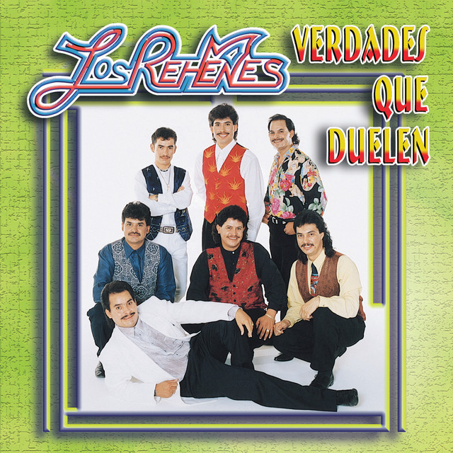

# jeliasx2.github.io

<!DOCTYPE html>
<html>
<link rel="stylesheet" href="style.css">

<!--SCRAPPED IDEAS
    Had an idea about having Sonic Jam's Museum Theme automatically play 
    in the background but not only is it not supported by modern browsers 
    but its not very well liked by average web surfers. Its still doable in some
    form but it seems to require JavaScript knowledge and it won't be worth
    much if people are very likely to turn it off. I get the reason but it 
    kinda of put me in a "this is not as fun as I hoped" mood if we're being 
    deadass honest
-->

<!--The website tab on Chrome, Edge, or whatever is used to surfer this site.-->
<head>
    <title>The MSU Bathroom</title>
</head>

    

        
ATTENTION!!!

        
ATTENTION!!!

        
ATTENTION!!!

        

            THE ARTICLE IS UNDER INVESTIGATION BY THE 
            UNITED NATIONS FOR CONTROVERSIAL VIDEOGAME OPINIONS. PLEASE EXERCISE 
            CAUTION WHEN HAVING THIS TAB OPEN WITH OTHER TABS
        

    

<body>
    

        
        
    

    

        <h2 class="new_article_text">NEWEST ARTICLE</h2>
        <h5 class="new_article_text">As of 13th of March, 2026 @ 1100a</h5>
    

    

        

            <h2 class="article_title">The Video Game Industrial BS</h2>
            <h5 class="article_title">By Jhair Elias-Elias</h5>
        

        

            

                <h3 class="article_body_title msu_green">Pay to play</h3>
                

                    For years, companies like Microsoft, Sony, and Nintendo have consistently tried to strip the video game enjoyer of every dollar and cent that exists in their bank accounts, their wallets, and the hidden corners of their home. Among the ways they continue to achieve this is through subscriptions to online services that necessary to enjoy the vast array of multiplayer games. Although you might make the claim that "nITenDO oNlinE is cHeap" or "sOnY and xboX LeT You pLaY ONlInE iN FRee MULTIPLAyER GamEs" or "YoU gEt ToNS of GAMES WiTh gAmE PasS", I will tell "That doesn't matter. What you have told me is the equivalent telling me to choose between eating a dried up dog shit found on the ground, a wet pile of dog shit found near a dumpster, and another wet pile of dog shit covered in sprinkles. It all the same to me, I am getting screwed and hardcore fan boys are vouching for their corporate overlords like if they are on the payroll. You may think the you're getting a deal with those extra games on Game Pass but once you end your time with them, you lose access too them. Effectively forcing you to buy them again or buy a physical copy to enjoy what was a really good game.  
                

            

            

                <h3 class="article_body_title msu_green">You don't own your games</h3>
                

                    Video game companies have really taken advantage of beauty of convenience that comes with having games downloaded on our system. Unlike the medieval period where I had to scourer my room for games to play, all those games I love to play are all conveniently located within my console, saving me time that I could be using telling a kid that I know what his mother's bedroom looks like. But despite how great that is for the consumer, video game companies will always try to find a way to pillage our benefits for their own personally gain and use it against us by slowing stripping us of our ownership of video games. Despite the inconvenience of having your games scattered about in your room during the medieval 1980s, you still have a physical copy of the game you love that has the literal code inside of it. Nowadays, companies like Microsoft like to trick you into thinking you bought a disc with the game inside but in reality, you bought portion of the game code which forces you to have Internet available to INSTALL THE REST. 
                

            

            

                <h3 class="article_body_title msu_green">Video Game Companies</h3>
                

                    In recent news, Electronic Arts has begun laying off employees across all Battlefield studios despite the success that came with the launch of Battlefield 6 and Blizzard have decided to start lay off employees despite efforts to literally revive what was effectively a dead video game known as Overwatch 2, now Overwatch. Greed has turned what were really great game companies into mindless zombies that prey on the innocent wallets of gamers from all walks of life. Companies like Blizzard, EA, Ubisoft, and 2K have turned great video game franchises into shells of their former selves and  hardcore fans continue to spend their hard earned dollars to keep them alive.  These video game companies know that fans of these franchises will come back for more and that all they need to do is keep them happy "here and there" and to only really try when the revenue seems a little thinner than usual. Gone are the days that video game companies look out for the consumers and what remains are household names looking out for their corporate shareholders and executives.
                

            

        

    

    

        <h2 class="msu_font main_header head_division">THE RANKED LISTS</h2>
        

            

                <ol class="ranked_box">
                    <h3 class="msu_green main_header">Worst Video Game Companies in my opinion</h3>
                    <li class="ol_li">
                        
EA

                    </li>
                    <li class="ol_li">
                        
Blizzard

                    </li>
                    <li class="ol_li">
                        
Nintendo

                    </li>
                    <li class="ol_li">
                        
Ubisoft

                    </li>
                    <li class="ol_li">
                        
SEGA

                    </li>
                </ol>
            

            

                <ul class="ranked_box">
                    <h3 class="msu_green main_header">My Personal Video Game Picks</h3>
                    <li class="ul_li_special">
                        <a href="https://en.wikipedia.org/wiki/Red_Dead_Redemption_2">Red Dead Redemption 2</a>
                    </li>
                    <li class="ul_li">
                        <a href="https://en.wikipedia.org/wiki/Call_of_Duty:_Black_Ops_II">Call of Duty: Black Ops 2</a>
                    </li>
                    <li class="ul_li">
                        <a href="https://en.wikipedia.org/wiki/Sonic_the_Hedgehog_(1991_video_game)">Sonic the Hedgehog (1991)</a>
                    </li>
                    <li class="ul_li">
                        <a href="https://en.wikipedia.org/wiki/BattleBlock_Theater">BattleBlock Theater </a>
                    </li>
                    <li class="ul_li">
                        <a href="https://en.wikipedia.org/wiki/The_Elder_Scrolls_III:_Morrowind">The Elder Scrolls: Morrowind</a>
                    </li>
                </ul>
            

        

    

    

        <h2 class="item1 msu_green main_header">SONG OF THE BATHROOM</h2>
        
        

            For the song of the article today, we are including the 1993 Mexican classic "No Te Vayas Hoy" by 
            Los Rehenes. Los Rehenes are a band that formed out of Zacatecas, Mexico in 1982 but didn't
            garner popularity until 1992. The song "No Te Vayas Hoy" is simply a song about someone asking
            loved one to not leave, pleading them to stay.
        

        <audio id="myAudio" class="item4" controls>
            <source id="audio" src="no_te_vayas_hoy.mp3" type="audio/mpeg">
            This browser does not support the audio
        </audio>
        
    

    

        
        

            <h2 class="main_header msu_green">About the Editor</h2>
            
This page was created by me, Jhair Elias, to be my personal vent space for topics and subjects that I so happened to be interested in. The page doesn't really have any coherence at all especially as you continue to read the page but rest assured, you are not missing out on much. Most of my opinions follow the opinions of the vast many that exist on the orbiting rock called Earth so reading my pages will be nothing more than something to waste your time on as you try to grasp whatever it is I am trying to say. I've never been good at speaking my mind so beware.

        

    

</body>
</html>
